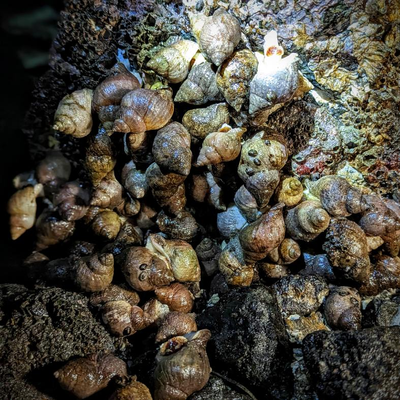
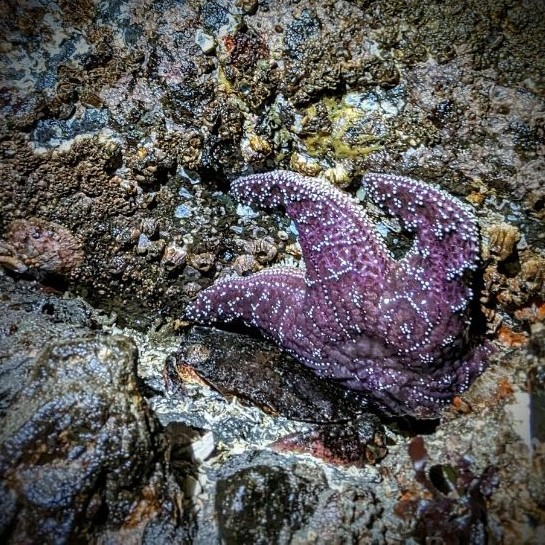
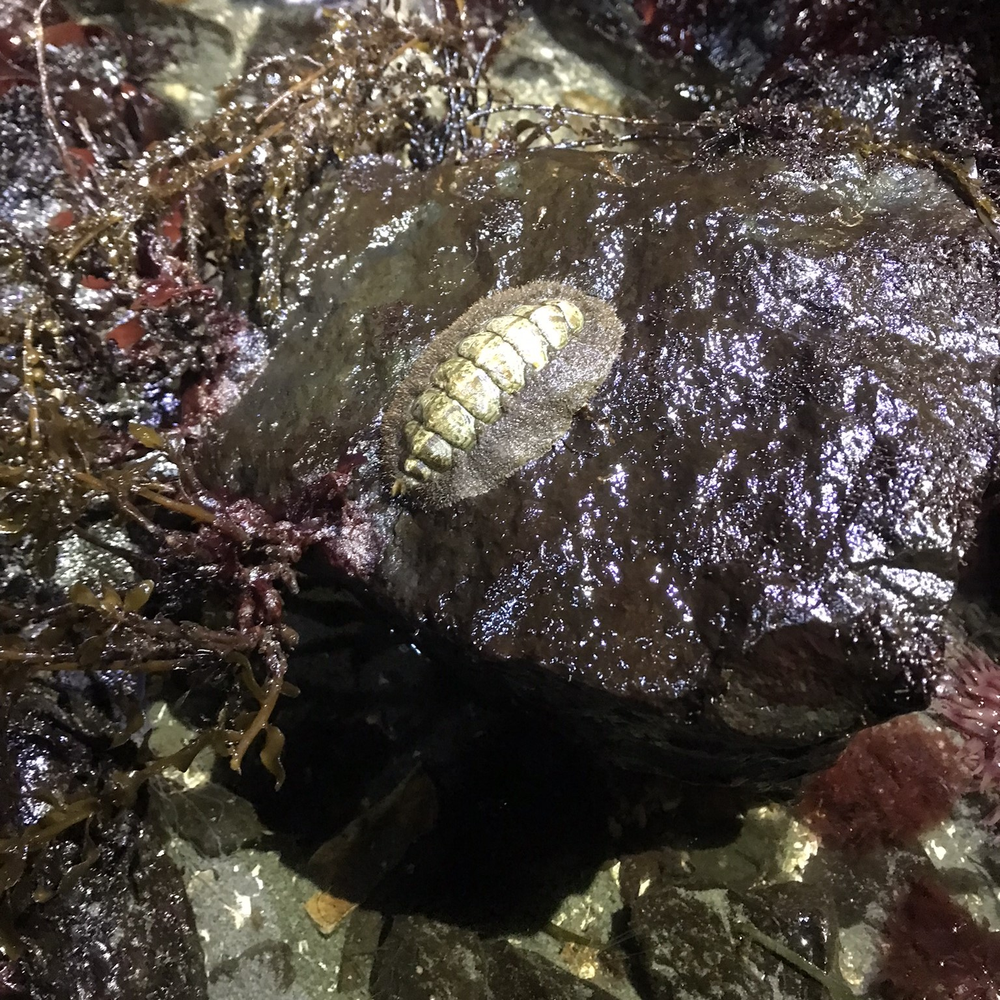
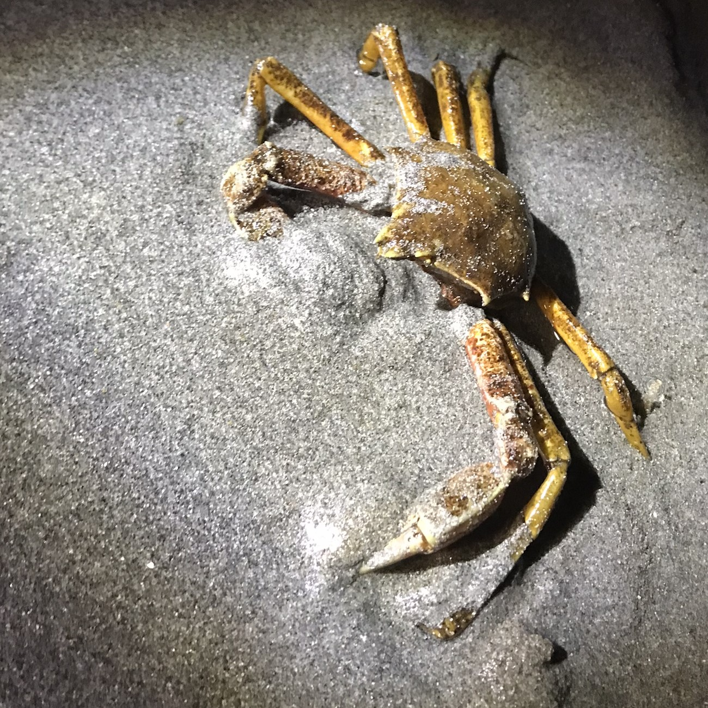

# California Intertidal Species Exploration
*Author: Justin Hamerly-Spain*

  
  
  
  

### Table of Contents

1. [Description](#description)
2. [Data Information](#data-information)
3. [Processing](#processing)
4. [Analysis](#analysis)
5. [Conclusion](#conclusion)

## Description

Using data from the California South Coast MPA Baseline Study on Rocky Intertidal systems this project aims to look for trends in seasonality around the populations of species as well as the sizes of species.  Also, how do the different sites differ in their sizes and populations - and do they stay consistent over the course of the study.  Lastly, are there correlations between the number of species recorded, and the sizes of those species?

## Data Information

All data comes from the state of California's open data set regarding rocky intertidal zones study from 2001 to 2014.  Four datasets were used in this project.  Below are links regarding this data and the study itself.

- [Rocky Intertidal Ecosystems, California South Coast MPA Baseline Study, 2001 to 2014](https://sandbox.data.ca.gov/dataset/rocky-intertidal-ecosystems-california-south-coast-mpa-baseline-study-2001-to-2014)

- **Datasets**
    - [Intertidal Class Table](./scmpaintertidalclasstable20150220.csv)
        
        *Intertidal Species scientific classifications and names.*

    - [Intertidal Site Table](./scmpaintertidalsitetable20150220.csv)
        
        *Intertidal Site Details.*

    - [Marine Species Counts](./sc_mpa_marine_species_counts_2015_0505.csv)
        
        *Details for numbers of species at a location by season.*

    - [Marine Species Sizes](./sc_mpa_marine_species_counts_2015_0505.csv)
        
        *Details for sizes of species at a location by season.*

## Processing

- [Data Processing HTML](./processing.html)
- [Data Processing Notebook](./processing.ipynb)

## Analysis

- [Data Analysis Notebook](./analysis.ipynb)

## Conclusion

